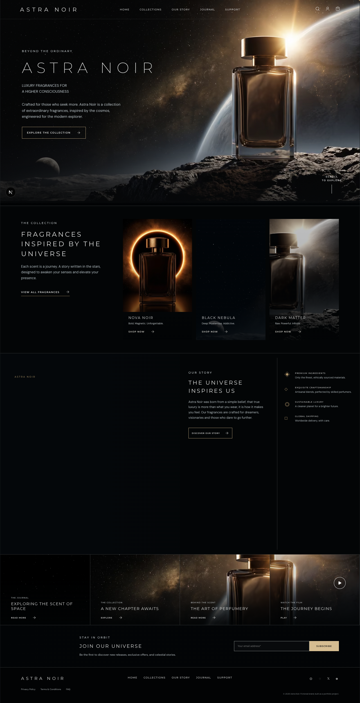
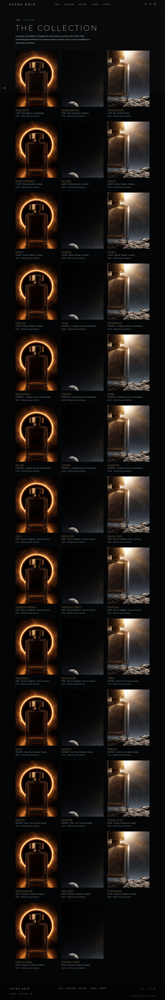
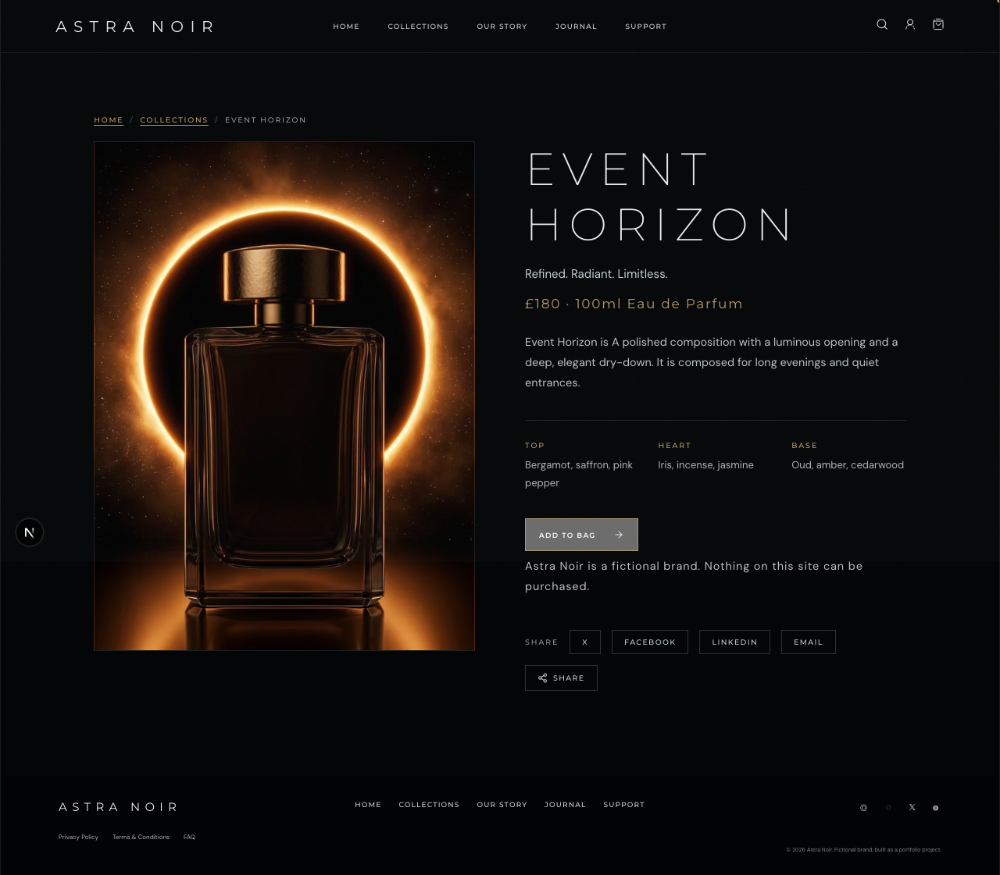

# Astra Noir

> Luxury fragrances for a higher consciousness.

> **Work in progress:** This portfolio project is actively being refined. Content, imagery, product details, and deployment configuration may change as the project develops.

**Live preview:** [temporary-agile-ocarina-dafvy99.vercel.app](https://temporary-agile-ocarina-dafvy99.vercel.app)

Astra Noir is a fictional luxury fragrance brand and portfolio project built around a demanding visual brief: cinematic imagery, a near-black palette, fast image delivery, and a complete browsing experience for a growing product collection.

The project began as a single-page concept and evolved into a statically rendered Next.js site with a full collection catalogue, generated product pages, journal content, structured metadata, and an image pipeline designed for responsive delivery.



## Highlights

- 38 fragrance products displayed in a responsive collection grid
- A generated detail page for every fragrance with notes, pricing, JSON-LD, sharing, and add-to-bag interaction
- Responsive image frames with AVIF, WebP, JPEG, `srcset`, LQIP placeholders, and lazy loading
- 57 statically generated routes across the storefront, journal, policy, support, and metadata surfaces
- Self-hosted Google font subsets through `next/font`
- Accessible navigation, skip link, focus states, image alt text, native FAQ disclosure, and reduced-motion support
- SEO metadata, canonical URLs, Open Graph image generation, sitemap, robots file, web manifest, and product schema

## Screenshots

| Collection grid                                       | Product detail                                           |
| ----------------------------------------------------- | -------------------------------------------------------- |
|  |  |

## Tech stack

- Next.js 16 App Router
- React 19
- Turbopack
- `next/font`
- Sharp
- Lucide React
- CSS, with no UI framework

## Getting started

Requirements: Node.js 20+ and npm.

```bash
npm install
npm run dev
```

Open [http://localhost:3000](http://localhost:3000).

### Production build

```bash
npm run build
npm start
```

The `prebuild` hook runs the image optimizer automatically. To regenerate image derivatives separately:

```bash
npm run images
```

## Project structure

```text
app/                 App Router pages and route metadata
components/          Shared UI, product cards, bag state, and image rendering
lib/data.js          Fragrance, journal, and FAQ content
lib/image-manifest   Generated image dimensions and responsive slot data
public/img/          Optimized image derivatives
scripts/              Build-time image optimization
```

## Design and engineering notes

The visual direction uses restrained typography, wide tracking, thin rules, and atmospheric photographic plates to make the catalogue feel editorial rather than transactional. The collection remains data-driven: adding a product means adding content to the shared data layer, and the static route generation creates its detail page automatically.

The image component reserves its frame before loading the source image, which prevents layout shift. Collection cards explicitly use a consistent 3:4 frame even when their source photography has a different native ratio.

## Portfolio context

Astra Noir is a fictional brand. Nothing is for sale and no payment is taken. The imagery is AI-generated; the application architecture, content model, responsive image pipeline, accessibility work, metadata layer, and interface implementation are hand-built.

## Deployment

The project is configured for Vercel deployment. The current anonymous preview is temporary and expires unless claimed. Set `NEXT_PUBLIC_SITE_URL` to the deployed origin so canonical URLs, Open Graph metadata, sitemap entries, and JSON-LD use the production URL:

```bash
NEXT_PUBLIC_SITE_URL=https://temporary-agile-ocarina-dafvy99.vercel.app
```

## License

This repository is a portfolio demonstration. Brand content and generated imagery are not licensed for commercial reuse.
